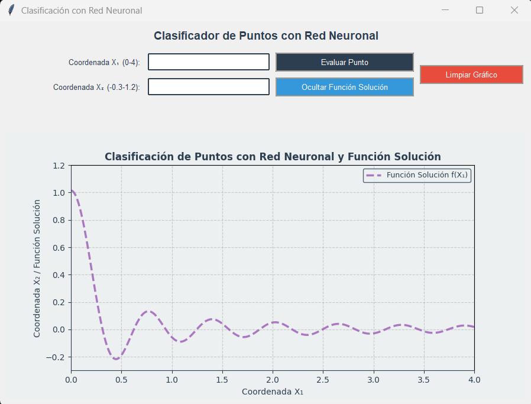

```markdown
# Clasificador de Puntos con Red Neuronal 🧠📊



Aplicación para clasificación de puntos 2D implementando un modelo Keras/TensorFlow con interfaz Tkinter.

## Estructura del proyecto 🗂️

PROYECTO_METODOS_NUMERICOS/
|-- Blackbox/
| |-- pycache/
| |-- init.py
| |-- blackbox_S.keras # Modelo pre-entrenado
| |-- blackbox.py # Módulo principal
| |-- blackbox_s.ipynb # Notebook de desarrollo
| |-- proyecto.py # Script principal
| |-- readme.md # Documentación
| `-- requirements.txt # Dependencias


## Requisitos técnicos ⚙️

**Versiones recomendadas:**
- Python 3.8+
- TensorFlow 2.8+
- Keras 2.8+
- Matplotlib 3.5+
- NumPy 1.21+

## Configuración inicial 🛠️

1. Instalar dependencias:
```bash
pip install -r Blackbox/requirements.txt
```

2. Ejecutar la aplicación:
```bash
python Blackbox/proyecto.py
```

## Funcionalidades clave 🔍

| Componente | Descripción |
|-----------|-------------|
| `blackbox.py` | Contiene las funciones `load_model()` y `predict_point()` |
| `proyecto.py` | Interfaz gráfica principal con Tkinter |
| `blackbox_S.keras` | Modelo pre-entrenado serializado |

## Uso de la interfaz 🖱️

1. Ingresar coordenadas:
   - X₁: Valor entre 0-4
   - X₂: Valor entre -0.3-1.2

2. Acciones disponibles:
   ```python
   # En proyecto.py
   self.evaluar_btn = ttk.Button(..., command=self.evaluar)  # Evaluar punto
   self.toggle_func_btn = ttk.Button(..., command=self.toggle_funcion)  # Mostrar/ocultar función
   self.limpiar_btn = ttk.Button(..., command=self.limpiar_grafico)  # Reiniciar gráfico
   ```

## Personalización 🎨

**Modificar estilos:**
```python
# En proyecto.py
COLOR_PRIMARIO = "#2c3e50"  # Color principal
COLOR_SECUNDARIO = "#3498db"  # Color secundario
```

**Ajustar rangos:**
```python
# En el método evaluar()
if x1_val < 0 or x1_val > 4:  # Validación X₁
if x2_val < -0.3 or x2_val > 1.2:  # Validación X₂
```

## Soporte técnico 🛠️

Problemas comunes:
1. Error al cargar el modelo:
   - Verificar que `blackbox_S.keras` exista en el directorio
   - Revisar compatibilidad de versiones de TensorFlow

2. Errores de visualización:
   ```bash
   pip install --upgrade matplotlib
   ```
